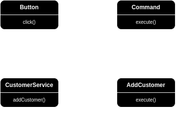

## The solution might be something like this—

You can release the `button` class from the responsibility and create a `Command Interface` that you will implement where every button is a command object. Here's the scenario:

Let's assume, you are developing a Bookshop Management System. You want to add a customer by clicking a button. There'll be a `Command Interface` with an `execute()` method. A class `AddCustomerCommand` to add a customer will implement the interface and call the `addCustomer()` method of another class `CustomerService` from the `execute()` method. So when the button is clicked, ultimately the `addCustomer()` will called. And with this implementation, we have avoided coupling between the invoker and the receiver.

  

## Yes, _Mi Amigo_, this is Command Pattern!